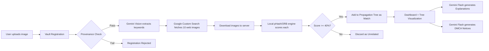

# DigiWarden — Hackathon Upgrade Plan

## Problem Statement

The current MVP only detects manipulation when the user manually provides variant images. A single-image upload returns a perfect 100% integrity score because there are no candidates to compare against. For a Google Hackathon demo targeting **Sports Media piracy**, the system must:

1. **Automatically find potential copies** on the web when given a single image.
2. **Mathematically prove** which scraped images are derivatives vs. unrelated.
3. **Prevent fraudulent uploads** — a pirate should not be able to register a stolen image as the original.
4. **Generate intelligent outputs** — AI-powered explanations and DMCA notices, not hardcoded strings.

## Architecture Overview



---

## Phase 1: Configuration & Dependencies

### [MODIFY] [.env.example](file:///c:/coding/New%20folder%20%282%29/.env.example)

Add the three new API keys. All are free-tier.

```diff
 # Backend (FastAPI)
 STORAGE_PATH=./data
 DB_URL=sqlite:///./data/contentgenome.db
+ENABLE_DEMO_VARIANTS=true
+
+# Google APIs (all free-tier)
+GEMINI_API_KEY=
+GOOGLE_CSE_API_KEY=
+GOOGLE_CSE_ID=

 # Frontend (Vite)
 VITE_API_BASE_URL=http://localhost:8000/api
```

### [MODIFY] [backend/app/settings.py](file:///c:/coding/New%20folder%20%282%29/backend/app/settings.py)

Add accessor functions for the new env vars. Follow the existing pattern (`get_storage_path`, `get_db_url`, etc.).

```python
def get_gemini_api_key() -> str | None:
    return os.getenv("GEMINI_API_KEY")

def get_google_cse_api_key() -> str | None:
    return os.getenv("GOOGLE_CSE_API_KEY")

def get_google_cse_id() -> str | None:
    return os.getenv("GOOGLE_CSE_ID")
```

### [MODIFY] [backend/requirements.txt](file:///c:/coding/New%20folder%20%282%29/backend/requirements.txt)

```diff
+google-generativeai>=0.8.0
+google-api-python-client>=2.100.0
+requests>=2.31.0
```

---

## Phase 2: Web Scraping Pipeline

### [NEW] backend/app/services/scraper_service.py

This is the core new module. It implements the **3-step hybrid pipeline**:

**Step 1 — Context Extraction (Gemini Vision)**
- Accepts image bytes.
- Sends them to `gemini-1.5-flash` with the prompt: *"You are analyzing a sports photograph. Describe the specific scene in exactly 5 search keywords. Example: 'Virat Kohli century celebration IPL 2024'. Return ONLY the keywords, nothing else."*
- Parses the plain-text response into a search query string.
- **Fallback**: If `GEMINI_API_KEY` is not set or the call fails, fall back to the image's original filename stripped of extensions (e.g., `lebron_dunk_game4.jpg` → `"lebron dunk game4"`).

**Step 2 — Web Candidate Fetching (Custom Search API)**
- Uses `googleapiclient.discovery.build("customsearch", "v1")`.
- Calls `.cse().list(q=keywords, searchType="image", num=10)`.
- Extracts the `link` field from each result item (the direct image URL).
- **Fallback**: If `GOOGLE_CSE_API_KEY` or `GOOGLE_CSE_ID` is not set, skip web scraping entirely and fall through to the existing demo-variant generation.

**Step 3 — Image Download**
- Uses `requests.get(url, timeout=8)` for each image URL.
- Validates `Content-Type` starts with `image/`.
- Saves each downloaded image via the existing `save_bytes_to_uploads()` helper in [storage_service.py](file:///c:/coding/New%20folder%20%282%29/backend/app/services/storage_service.py).
- Creates an `ImageRow` with `variant_of=root.id` and `source_kind="web_scrape"`.
- Returns the list of newly created `ImageRow` IDs.

**Error handling**: Each download is wrapped in try/except. Failures are logged and skipped — we never crash the pipeline because one URL timed out.

```python
# Public API
def scrape_web_candidates(
    db: Session,
    root_image_id: str,
    root_image_path: str,
) -> list[str]:
    """Returns list of newly created image IDs from web scraping."""
```

### [MODIFY] [backend/app/services/analysis_service.py](file:///c:/coding/New%20folder%20%282%29/backend/app/services/analysis_service.py)

Currently, lines 121-143 handle variant gathering. The change:

```python
# BEFORE (line 126):
if not candidates and demo_variants_enabled():
    demo_variants = generate_demo_variants(root_abs)
    ...

# AFTER:
if not candidates:
    # Try web scraping first
    from .scraper_service import scrape_web_candidates
    web_ids = scrape_web_candidates(db, root.id, root_abs)

    if web_ids:
        # Re-query variants to pick up the newly scraped images
        variants = db.execute(stmt).scalars().all()
        candidates = list(variants)

    # If web scraping found nothing (or was disabled), fall back to demo mutations
    if not candidates and demo_variants_enabled():
        demo_variants = generate_demo_variants(root_abs)
        ...
```

> [!IMPORTANT]
> The demo-variant fallback is kept as a safety net. During a live presentation, if the Custom Search API returns no relevant images, the system still produces a populated dashboard instead of showing an empty state.

### [MODIFY] [backend/app/models.py](file:///c:/coding/New%20folder%20%282%29/backend/app/models.py)

Add a `source_url` column to `ImageRow` so we can track *where* a web-scraped image came from:

```python
class ImageRow(Base):
    ...
    source_url: Mapped[Optional[str]] = mapped_column(String, nullable=True)
```

This lets the DMCA notice and the tree visualization link back to the exact pirate URL.

---

## Phase 3: AI-Powered Explanations

### [NEW] backend/app/services/gemini_service.py

A thin wrapper around the `google-generativeai` SDK. All Gemini calls go through here.

```python
import google.generativeai as genai
from ..settings import get_gemini_api_key

_configured = False

def _ensure_configured():
    global _configured
    if not _configured:
        key = get_gemini_api_key()
        if not key:
            raise RuntimeError("GEMINI_API_KEY not set")
        genai.configure(api_key=key)
        _configured = True

def generate_explanation(context: dict) -> str:
    """Generate a forensic explanation for a tree node."""
    _ensure_configured()
    model = genai.GenerativeModel("gemini-1.5-flash")
    prompt = (
        "You are a digital forensics expert for a sports media agency. "
        "A system detected that an image was copied. Here is the evidence:\n"
        f"- Mutation type: {context['mutation_type']}\n"
        f"- pHash similarity: {context['phash_score']}%\n"
        f"- ORB keypoint match: {context['orb_score']}%\n"
        f"- Combined similarity: {context['combined_score']}%\n"
        f"- Classification: {context['authenticity_label']}\n\n"
        "Explain in 3-4 sentences exactly what manipulation was likely applied "
        "and why the mathematical evidence proves this is a derivative copy. "
        "Use professional but accessible language."
    )
    response = model.generate_content(prompt)
    return response.text

def generate_dmca_text(context: dict) -> str:
    """Generate a professional DMCA takedown notice."""
    _ensure_configured()
    model = genai.GenerativeModel("gemini-1.5-flash")
    prompt = (
        "You are a legal agent for a sports broadcasting network. "
        "Draft a formal DMCA takedown notice under 17 U.S.C. 512(c) using this evidence:\n"
        f"- Owner: {context['owner_name']}\n"
        f"- Owner email: {context['owner_email']}\n"
        f"- Original asset registered at: {context['registered_at']}\n"
        f"- Infringing URL: {context.get('source_url', '[URL not available]')}\n"
        f"- Similarity score: {context['similarity_score']}%\n"
        f"- pHash: {context['phash_score']}%, ORB: {context['orb_score']}%\n"
        f"- Detected manipulation: {context['mutation_type']}\n\n"
        "Include all 6 standard DMCA sections. Be formal and legally precise. "
        "Reference the mathematical evidence as proof of derivation."
    )
    response = model.generate_content(prompt)
    return response.text
```

### [MODIFY] [backend/app/routers/explain.py](file:///c:/coding/New%20folder%20%282%29/backend/app/routers/explain.py)

Replace the hardcoded placeholder (lines 30-34) with:

```python
# Try Gemini first, fall back to deterministic placeholder
try:
    from ..services.gemini_service import generate_explanation
    explanation = generate_explanation({
        "mutation_type": node.get("mutation_type"),
        "phash_score": node.get("breakdown", {}).get("phash_score", 0),
        "orb_score": node.get("breakdown", {}).get("orb_score", 0),
        "combined_score": node.get("similarity_score", 0),
        "authenticity_label": node.get("authenticity_label", "Unknown"),
    })
except Exception:
    explanation = (
        f"This node appears to be a derived copy. "
        f"Detected mutation: {node.get('mutation_type')}. "
        f"Similarity: {node.get('similarity_score')}%."
    )
```

### [MODIFY] [backend/app/services/dmca_service.py](file:///c:/coding/New%20folder%20%282%29/backend/app/services/dmca_service.py)

Replace the string-concatenation draft (lines 104-133) with:

```python
try:
    from .gemini_service import generate_dmca_text
    draft = generate_dmca_text({
        "owner_name": owner_name,
        "owner_email": owner_email,
        "registered_at": root_node.get("created_at") if root_node else "Unknown",
        "source_url": evidence_node.get("source_url") or evidence_url,
        "similarity_score": evidence_similarity,
        "phash_score": breakdown.get("phash_score", "N/A"),
        "orb_score": breakdown.get("orb_score", "N/A"),
        "mutation_type": mutation_type,
    })
except Exception:
    # Fall back to the existing deterministic template
    draft = (... existing string concatenation ...)
```

> [!TIP]
> The fallback ensures the demo never breaks. If Gemini rate-limits you mid-presentation (15 RPM on free tier), the system gracefully degrades to the template.

---

## Phase 4: Provenance Verification

### [MODIFY] [backend/app/models.py](file:///c:/coding/New%20folder%20%282%29/backend/app/models.py)

Add `sha256_hash` and `phash` columns to `ImageRow`:

```python
class ImageRow(Base):
    ...
    sha256_hash: Mapped[Optional[str]] = mapped_column(String(64), nullable=True)
    phash: Mapped[Optional[str]] = mapped_column(String(32), nullable=True)
```

### [MODIFY] [backend/app/routers/upload.py](file:///c:/coding/New%20folder%20%282%29/backend/app/routers/upload.py)

Add a provenance check before saving to the Vault:

```python
import hashlib
from engine.fingerprint import generate_phash
from engine.similarity import compare_phash

@router.post("/upload", response_model=UploadResponse)
async def upload_image(file: UploadFile = File(...), db: Session = Depends(get_db)):
    # 1. Read bytes and compute SHA-256
    file_bytes = await file.read()
    sha256 = hashlib.sha256(file_bytes).hexdigest()

    # 2. Check for exact duplicate (same file uploaded twice)
    existing = db.execute(
        select(ImageRow).where(ImageRow.sha256_hash == sha256)
    ).scalars().first()
    if existing:
        raise HTTPException(400, "This exact image is already registered in the Vault.")

    # 3. Save to disk, compute pHash
    file.file.seek(0)
    image_id = str(uuid4())
    storage_rel, size_bytes = save_upload_to_disk(file, image_id)
    abs_path = str(get_storage_path() / storage_rel)
    phash = generate_phash(abs_path)

    # 4. Check for perceptual near-duplicate (different file, same visual content)
    all_root_images = db.execute(
        select(ImageRow).where(ImageRow.variant_of.is_(None))
    ).scalars().all()
    for root_img in all_root_images:
        if root_img.phash and compare_phash(phash, root_img.phash) > 0.90:
            raise HTTPException(
                409,
                f"This image is perceptually identical to an existing asset "
                f"(ID: {root_img.id}). It cannot be registered as a new original."
            )

    # 5. Create row with provenance fields
    row = ImageRow(
        id=image_id, filename=file.filename, storage_path=storage_rel,
        content_type=file.content_type, size_bytes=size_bytes,
        sha256_hash=sha256, phash=phash,
        variant_of=None, created_at=datetime.now(timezone.utc),
    )
    ...
```

### [MODIFY] [backend/app/schemas.py](file:///c:/coding/New%20folder%20%282%29/backend/app/schemas.py)

Update `UploadResponseData` to surface the provenance fields:

```python
class UploadResponseData(BaseModel):
    image_id: str
    filename: str
    upload_time: datetime
    sha256_hash: Optional[str] = None
    vault_status: str = "registered"
```

---

## Phase 5: Frontend Changes

### [MODIFY] [frontend/src/pages/UploadPage.jsx](file:///c:/coding/New%20folder%20%282%29/frontend/src/pages/UploadPage.jsx)

After the "ORIGINAL ASSET" label overlay on the image preview (around line 194), add a "Vault Registered" badge:

```jsx
<div style={{
  display: 'inline-flex', alignItems: 'center', gap: 6,
  padding: '4px 10px', borderRadius: 6,
  background: 'rgba(34,197,94,0.1)',
  border: '1px solid rgba(34,197,94,0.2)',
  marginTop: 6,
}}>
  <Shield size={11} color="var(--green)" />
  <span style={{ fontSize: 11, color: 'var(--green)', fontWeight: 600 }}>
    VAULT REGISTERED
  </span>
</div>
```

Update `PIPELINE_STEPS` in [useApi.js](file:///c:/coding/New%20folder%20%282%29/frontend/src/hooks/useApi.js) (line 7-14) to add a web scan step:

```javascript
export const PIPELINE_STEPS = [
  { id: 'upload', label: 'Register to Vault', desc: 'SHA-256 hash + pHash recorded as proof of ownership.' },
  { id: 'variants', label: 'Attach Candidate Copies', desc: 'Optional variants uploaded and linked to the root asset.' },
  { id: 'webscan', label: 'Scan Internet for Copies', desc: 'Gemini Vision + Google Custom Search scrape the web.' },
  { id: 'analyze', label: 'Run Similarity Engine', desc: 'pHash, ORB, and semantic scoring on all candidates.' },
  { id: 'poll', label: 'Track Live Job Status', desc: 'Polling until the background analysis completes.' },
  { id: 'results', label: 'Load Results', desc: 'Analysis, similarity, fingerprint, and variant data fetched.' },
  { id: 'tree', label: 'Build Propagation Tree', desc: 'Graph rendered from the backend tree response.' },
]
```

### [MODIFY] [frontend/src/pages/LandingPage.jsx](file:///c:/coding/New%20folder%20%282%29/frontend/src/pages/LandingPage.jsx)

Fix the garbled placeholder text on lines 105-121. Replace with coherent copy:

```javascript
const features = [
  { icon: Fingerprint, title: 'Fingerprint Detection', desc: 'pHash + ORB + semantic embeddings fused into a single score.' },
  { icon: GitBranch,   title: 'Propagation Mapping',  desc: 'Visualize how copies spread across the internet as a DAG.' },
  { icon: FileText,    title: 'DMCA Workflow',         desc: 'AI-generated takedown notices with mathematical evidence.' },
]

const why = [
  { icon: Shield, title: 'Cryptographic provenance',    desc: 'SHA-256 + pHash vault registration proves ownership at upload time.' },
  { icon: Zap,    title: 'Automated web scanning',      desc: 'Gemini Vision + Google Search find copies across the internet.' },
  { icon: Globe,  title: 'One-click legal action',      desc: 'Generate platform-ready DMCA notices backed by forensic data.' },
]
```

### [MODIFY] [frontend/src/components/NodeDetailPanel.jsx](file:///c:/coding/New%20folder%20%282%29/frontend/src/components/NodeDetailPanel.jsx)

Add a "Source URL" link below the TRANSFORMATION section (after line 77) so judges can see where the scraped image came from:

```jsx
{node.source_url && (
  <div style={{ padding: '12px 18px', borderBottom: '1px solid var(--border2)' }}>
    <div style={{ fontFamily: 'JetBrains Mono, monospace', fontSize: 10, color: 'var(--text3)', marginBottom: 6, letterSpacing: '0.08em' }}>
      SCRAPED FROM
    </div>
    <a href={node.source_url} target="_blank" rel="noopener noreferrer"
       style={{ fontSize: 12, color: 'var(--orange)', wordBreak: 'break-all' }}>
      {node.source_url}
    </a>
  </div>
)}
```

---

## Phase 6: Demo Rehearsal Checklist

Before the live presentation:

1. **Pre-seed pirate images**: Take 3-4 sports photos, apply crops/filters/watermarks, and upload them to a public Imgur album or a test blog.
2. **Configure Custom Search Engine**: Create a Programmable Search Engine at [programmablesearchengine.google.com](https://programmablesearchengine.google.com). For a guaranteed demo, restrict it to index only your seeded pirate site. For a more impressive demo, set it to search the entire web.
3. **Test the fallback chain**: Temporarily unset `GEMINI_API_KEY` and verify the system falls back to filename-based search and deterministic DMCA templates without crashing.
4. **Test the provenance rejection**: Try uploading the same image twice and verify the "already registered" error appears.
5. **Verify rate limits**: The free-tier Custom Search API allows 100 queries/day. The free-tier Gemini Flash allows 15 RPM. Plan your demo to stay within these limits.

---

## Verification Plan

### Automated Tests

```bash
# Existing tests still pass
pytest tests/test_engine.py
pytest tests/test_api_flow.py

# New test: provenance rejection
# Add to tests/test_api_flow.py:
# - Upload image A → success
# - Upload image A again → 400 "already registered"
# - Upload image A with slight crop → 409 "perceptually identical"
```

### Manual Verification

| Test | Expected Result |
|------|----------------|
| Upload a sports photo with no API keys set | Demo variants generated, dashboard populated (fallback works) |
| Upload with all API keys set | Gemini extracts keywords, Custom Search returns images, engine scores them |
| Click a node in the Tree | Gemini Flash returns a 3-4 sentence forensic explanation |
| Generate DMCA for an infringing node | Gemini Flash returns a formal legal notice with evidence cited |
| Upload a screenshot of an already-vaulted image | Upload rejected with provenance error |
